# SONY CD/DVD Player DVP-NF575P

## Checklist

- [x] Reference materials
    - [x] Manufacturer docs
    - [N/A] Firmware updates
    - [N/A] OpenWRT support
    - [N/A] Pinouts
- [N/A] Factory reset
- [x] External documentation
- [x] Case opened
- [x] Internal documentation
- [ ] Dumped ROM
- [ ] Extracted FW parts, inspected
- [ ] Factory reset with boot
- [ ] Dumped ROM regular
- [ ] Booted
- [ ] Root shell
- [ ] Pull stats
    - [ ] `uname -a`
    - [ ] `busybox --help`
    - [ ] `cat /proc/mtd`
- [ ] 

## Critical Info

```text
Serial: 2054339 
4A
11W
AC 120V 60Hz
```


## Reference material:

* [Manufacturer reference](https://www.sony.com/electronics/support/home-video-dvd-players-recorders/dvp-ns575p/manuals)
Copyrighted 2003.

## Inside

Opening

Boards

### Chips

#### SONY DSP

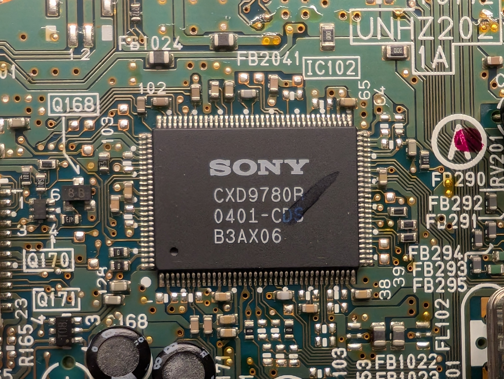

```text
SONY
CXD9780R
0401-CDS
B3AX06
```

Quad Flat Package (QFP) with 144 pins

DSP

#### SONY DSP 2?

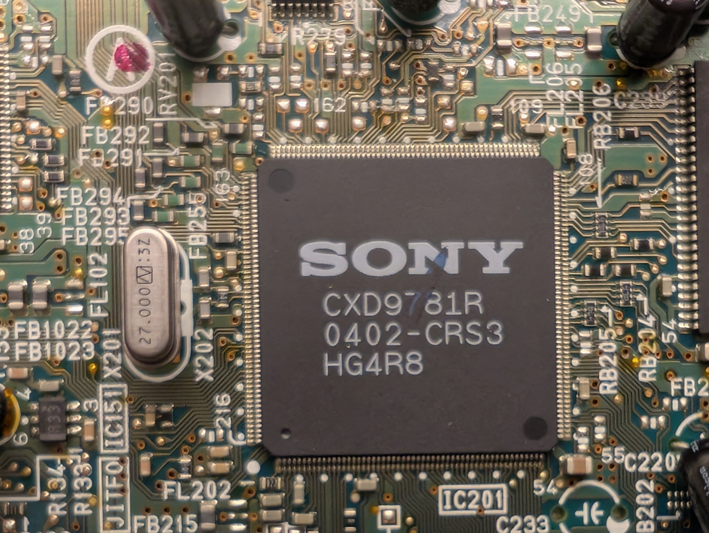

```text
SONY
CXDR9781R
0402-CRS3
HG4R8
```

Right next to a 27.000 MHz xtal.

#### IC206 SAMSUNG 64Mib SDRAM

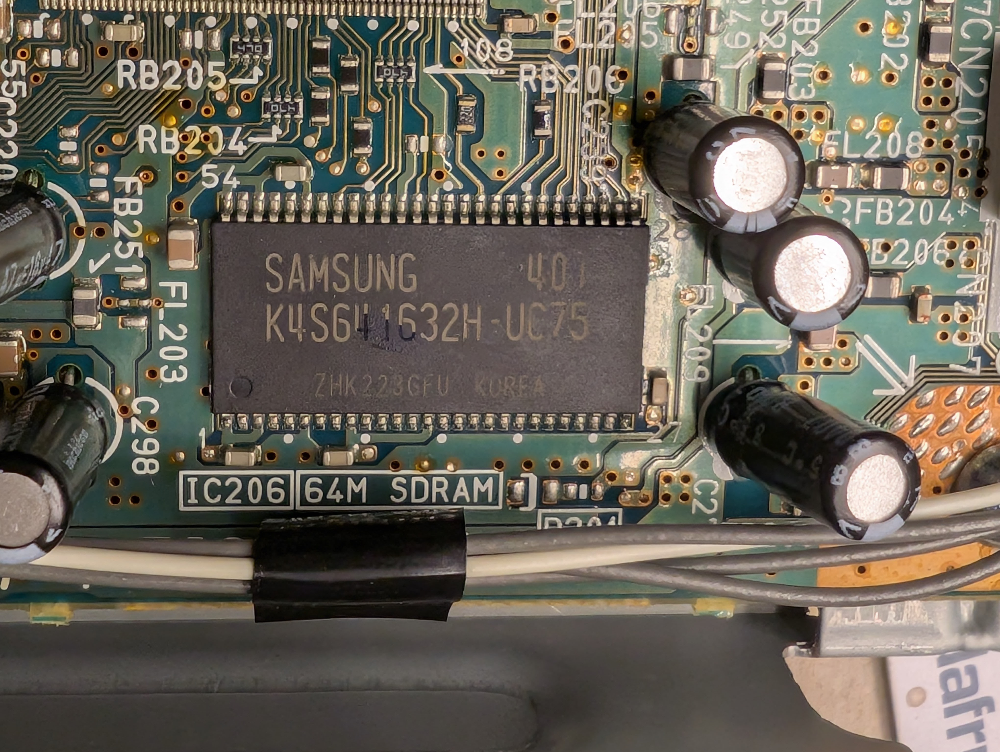

```text
SAMSUNG
K4S641632H-UC75
ZHK223GFU  KOREA
```

The board says `64M SDRAM`.

64 Mib = 8 MiB

Voltage: 3.3V power supply.
Speed/Frequency: 133 MHz maximum clock frequency.
Access Time: 5.4 ns.
Architecture: 4 Internal Banks.


#### IC204 Fuji 16Mib Flash ROM

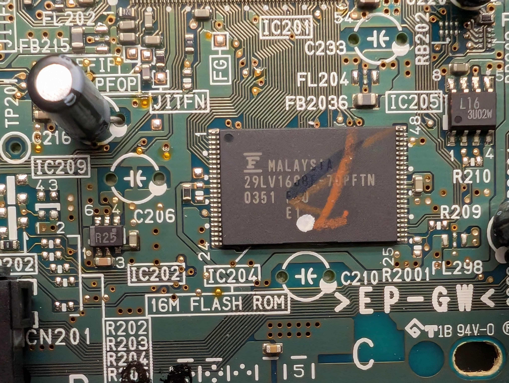

```text
F
19LV160BE-70PFTN
0351 ??U
     E1
```

16 Mib = 2 MiB

LV implied to mean "low voltage", i.e. 3.3V

Package: 48-pin TSOP (I)

Probably shares a pinout with: [FUJITSU MBM29LV160TE/BE](https://www.alldatasheet.com/datasheet-pdf/pdf/61808/FUJITSU/MBM29LV160TE.html).
That's 16 address pins, and 16 data pins!
It is supported by flashrom, but requires a very parallel programmer.

I have neither a carrier board, nor a programmer for this chip.

#### Fairchild FAN8036L Motor Driver

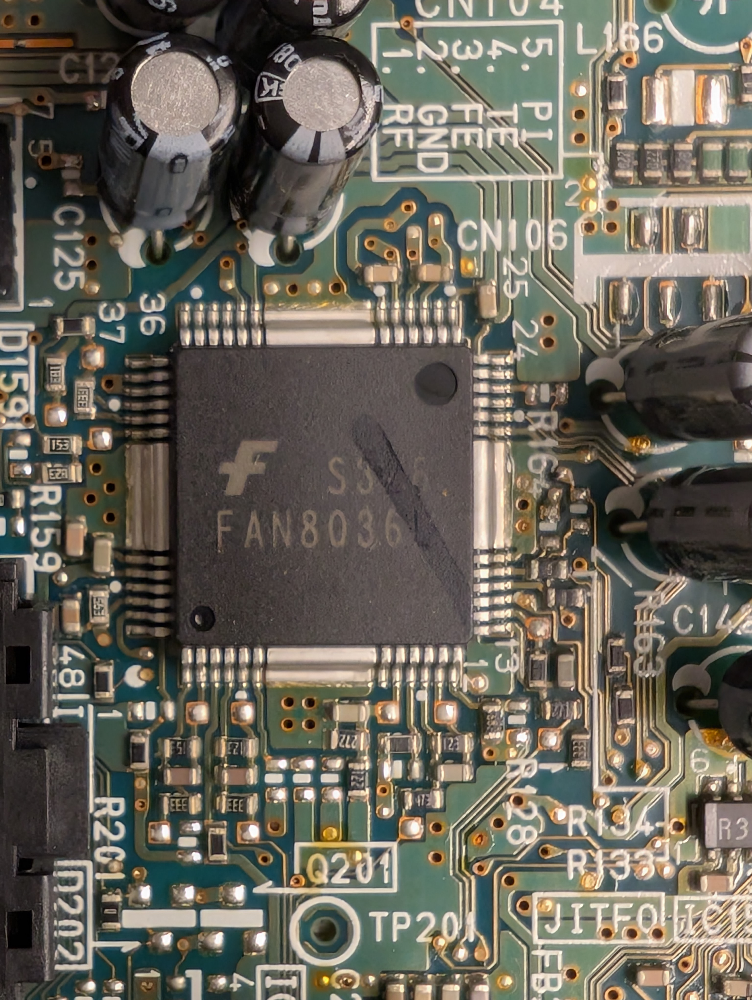

```text
F  S328
FAN8036L
```

5-channel motor driver with two built-in voltage regulators

The channels might be:
* Track and focus for the laser
* Sled
* Spindle
* Tray

[Datasheet](https://www.mouser.com/datasheet/2/149/FAN8036-336162.pdf?srsltid=AfmBOopKNoNJpYWtCmp8q4mAtlNftoJ0z644vLGEZmyZxwz-NHJOIEVz)

#### IC207 AKM DAC

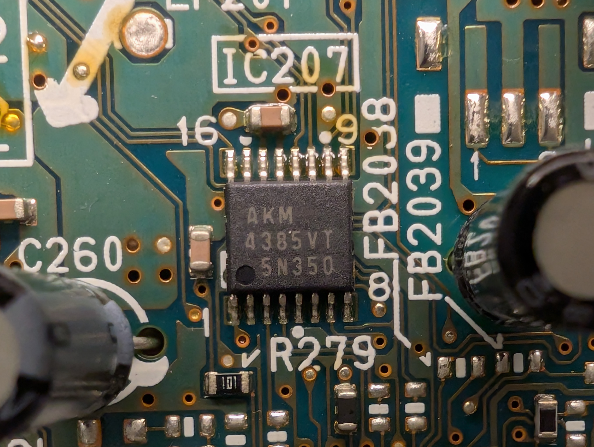

```text
AKM
4385VT
5N350
```

TSSOP-16

24-bit, 192kHz 2-channel Digital-to-Analog Converter (DAC)

Nice.

#### IC601 JRC 4558 Dual Op Amp

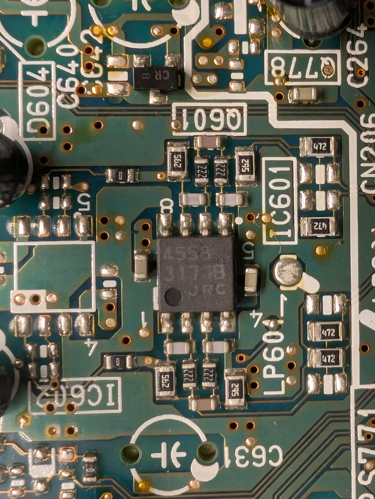

```text
4558
3173B
JRC
```

#### IC503 Negative Voltage Regulator

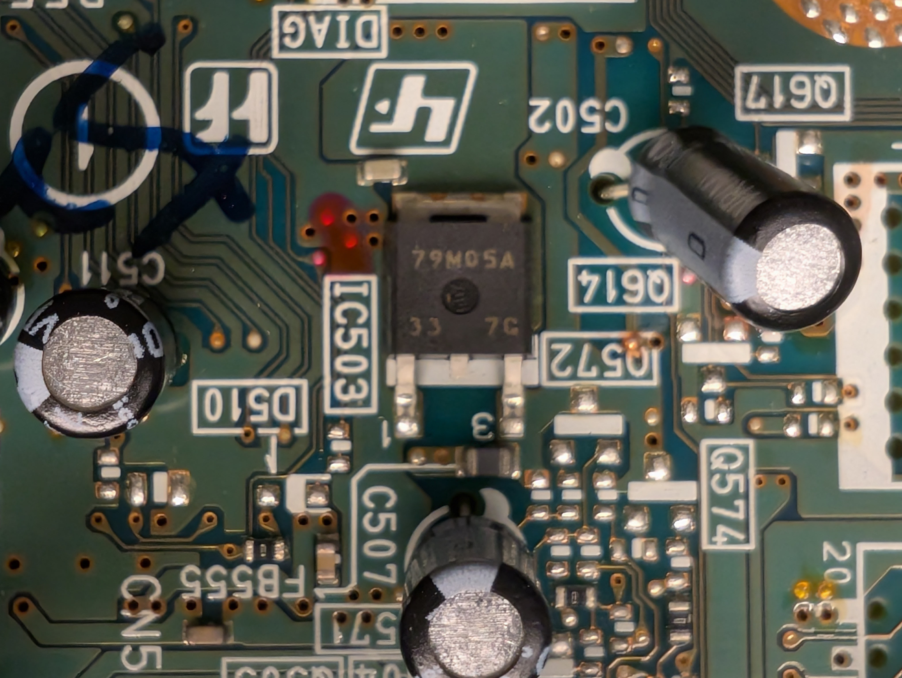

```text
79MO5A
33  7G
```

Output: -5.0V, 0.5A

Context implies a power management device.

#### IC205

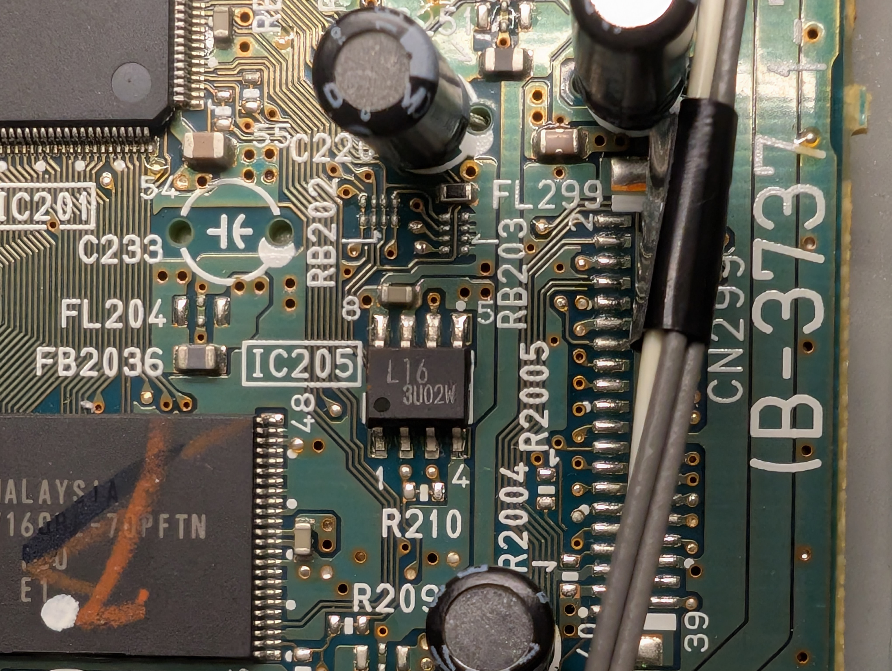

```text
L16
3U02W
```

### Connectors

#### CN771 Mainboard Power

Runs from the power supply to the mainboard.

Measured in the on, `NO DISC` state.

1. 8.18 V
2. 0 (10 ohms to ground, for some reason.)
3. 11.6 (16.9 in standby)
4. 5 (standby)
5. 3.3
6. -5
7. GND
8. 3.16
9. 3.3 (standby)
10. -10.4 (-17.9 in standby)

#### CN106 (not populated)

Markings say:

1. RF (connects to CN204 DIAG port, pin 6)
2. GND (verified)
3. FE
4. TE
5. PI

#### CN204 "DIAG"

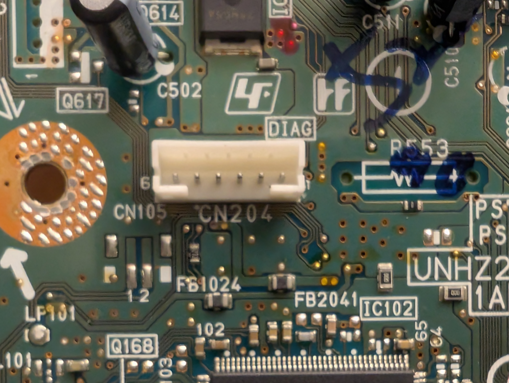

This connector is labeled "DIAG", and might be my best bet at a JTAG port.

1. CDX9781R pin 74
2. CDX9781R pin 73
3. GND
4. 3.3V (from CN771 pin 5)
5. CDX9780R pin 15
6. CN106 pin 1 "RF"

[boot_CN204.sal](boot_CN204.sal)

I checked the values with a logic analyzer.
Pin 6 goes up any time the disc spindle is running.

Pins 1 and 2 looked like my most likely shot at a UART.
They both went high, which is good, but never pulled either line down.
If I recall correctly, UART lines are high,
and then get held low by the transmitter.

I could pump some noise into them and see what happens, but nah.

#### CN?0?

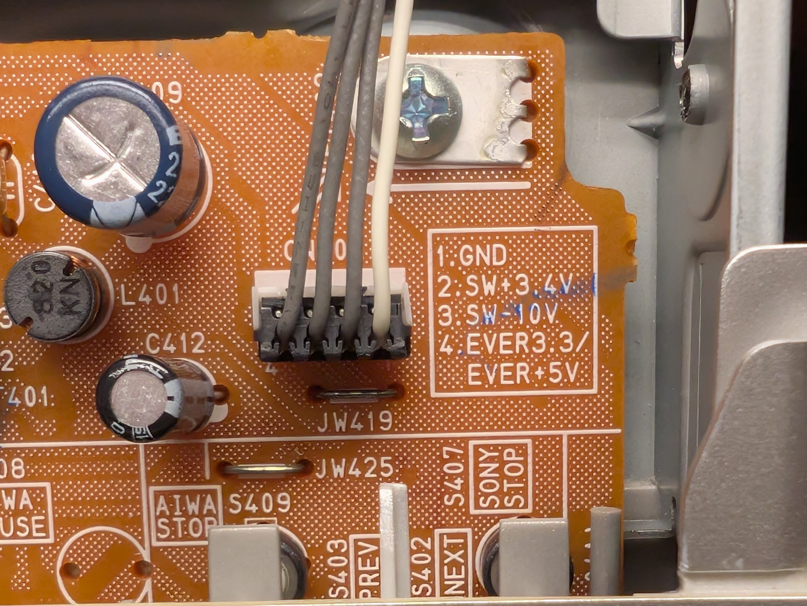

Markings say:

1. GND
2. SW+3.4V
3. SW-10V
4. EVER3.3/EVER+5V

Not quite sure what all those mean.
Maybe `SW` means software? Switch?
Maybe `EVER` means standby power?

#### CN402

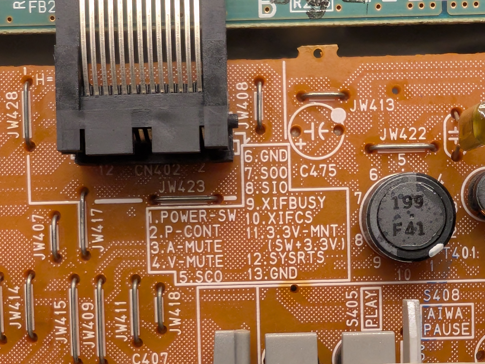

Markings say:

1. POWER-SW
2. P-CONT
3. A-MUTE
4. V-MUTE
5. SCO
6. GND
7. SOO
8. SIO
9. XIFBUSY
10. XIFCS
11. 3.3V-MNT (SW+3.3V)
12. SYSTRS
13. GND


### Firmware

Didn't.

### Conclusion: Unsuccessful Hack

I didn't expect to be able to do much with a SONY device,
especially one of this vintage.

SONY loves to be proprietary.
If I recall correctly,
their DISCMAN players had odd-sized headphone plugs,
just to be incompatible. 

I could probably learn something from downloading the firmware,
but I don't have any carrier boards that can take a TSSOP-48 Type I.
I don't feel like investing in any because I'm not as interested in devices from that era.

I think I'll just let this one go.
